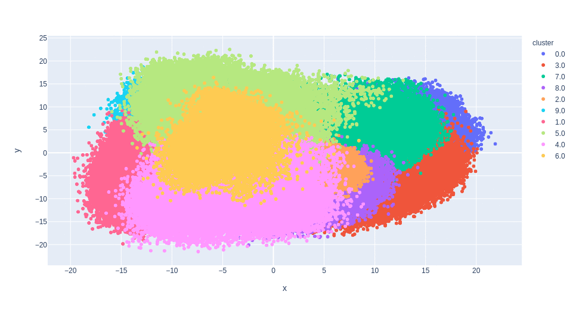
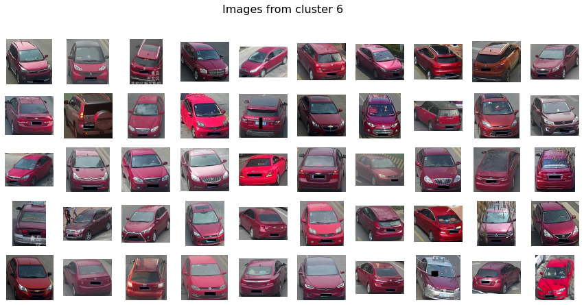
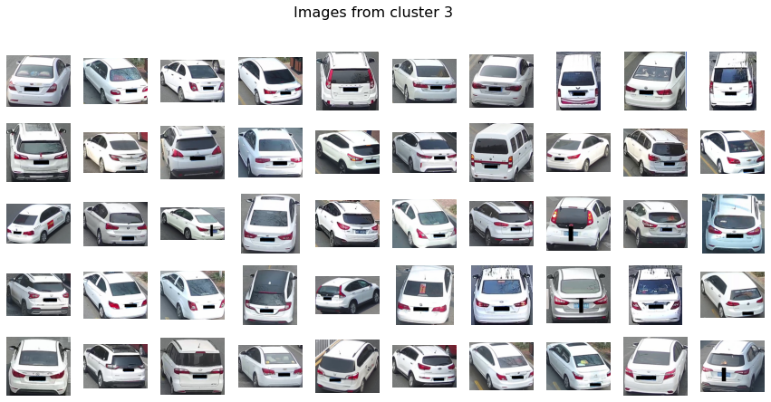
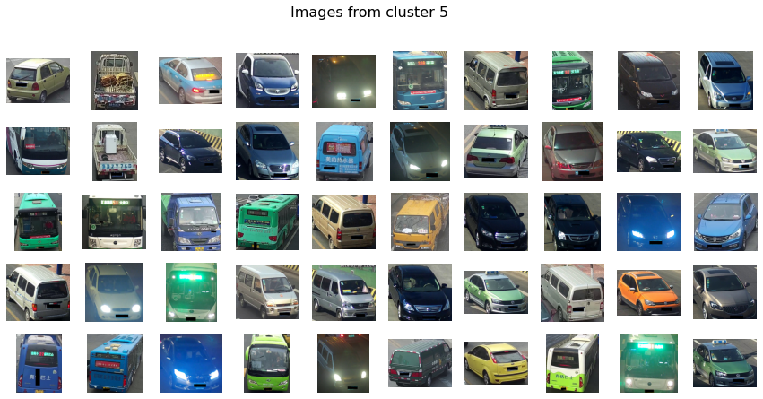
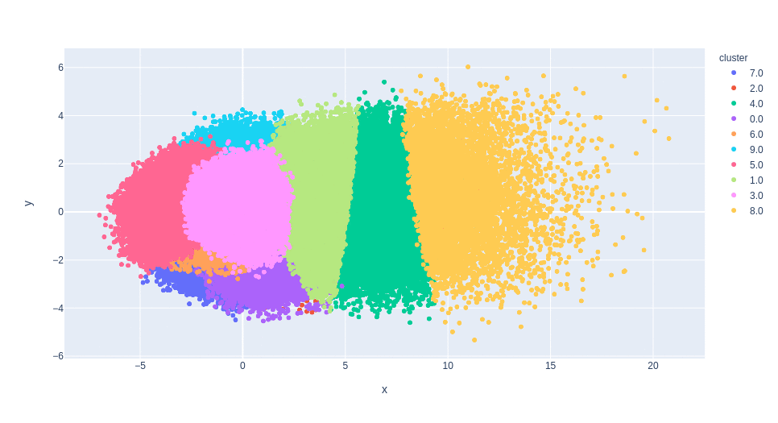
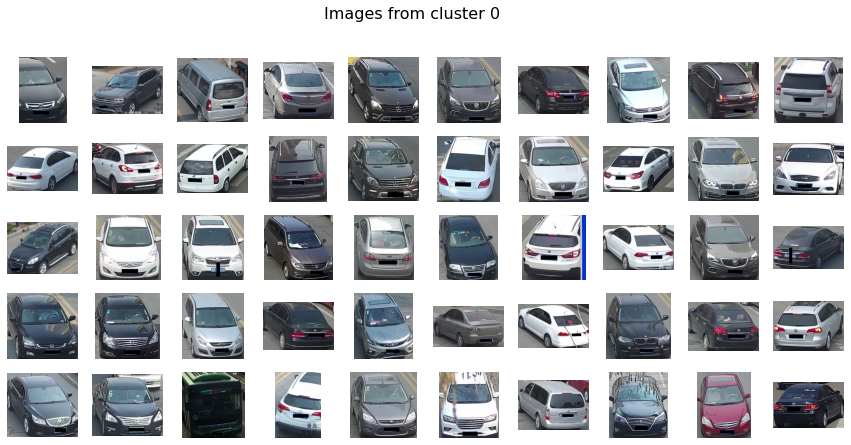
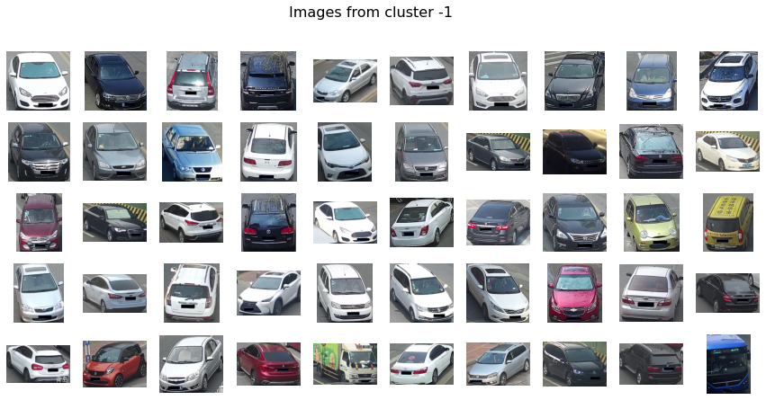

# intellivision_clustering

[Дескрипторы и ноутбук](https://drive.google.com/drive/folders/1-D4VfBQ43bvDfjDRc9IlA6Ecqfn2m0Ll)

| Descriptor    |  Size | Method          | calinski_harabasz_score | davies_bouldin_score | cluster interpretation |
| ---           | ---   | ---             | ---                     | ---                  | ---                     |
| osnet         | 200   | MiniBatchKMeans |  23471                  | 2.7                  | by color |
| osnet         | 200   | DBSCAN euclidean|  45                     | 2.9                  | no |
| osnet         | 200   | DBSCAN cosine   |  20                     | 9.1                  | no |
| osnet         | 200   | AgglomerativeClustering |  2042           | 2.9                  | no |
| efficient net | 200   | MiniBatchKMeans |  111654                 | 1.8                  | no |
| efficient net | 200   | DBSCAN euclidean|  588                    | 3.5                  | no |
| efficient net | 200   | DBSCAN cosine   |  376                    | 3.1                  | no |
| vdc_color     | 128   | MiniBatchKMeans |  111654                 | 1.82                 | by color |
| vdc_color     | 128   | GaussianMixture |  26791                  | 1.7                  | by color |
| vdc_type      | 200   | MiniBatchKMeans |  119597                 | 1.6                  | by type |

## Предобработка дескрипторов

Перед обучением алгоритмов кластеризации в исходных дескрипторах
сначала уменьшалась размерность (PCA) до 200 признаков, если изначальная размерность дескриптора была больше.

## Кластеризация по цвету

osnet и vdc_color дескрипторы, как оказалось, имеют похожую семантику:
при кластеризации методом MiniBatchKMeans кластеры обоих дескрипторов
оказались разделены по цвету. Но в отличие от vdc_color, кластеризация
построенная на osnet лучше справлялась с большим количеством кластеров.
В то время как при увеличении n_clusters для vdc_color дескрипторов,
в результирующих кластерах начинали появляться дублирующиеся цвета.

Но при `n_clusters = 4` кластеры оказались довольно четкими:
* белые
* черные
* холодные цвета
* теплые цвета

MiniBatchKMeans и GaussianMixture дали похожие результаты на дескрипторах vdc_color

## Кластеризация по типу

Как ожидалось, кластеры полученные с помощью vdc_type дескрипторов
разделили ТС по их типу. Но этот признак сложнее интерпретировать чем цвет
даже человеку. И некоторые кластеры были качественно неотличимы.

## Неинтерпретируемая кластеризация

#### DBSCAN

Ну удалось подобрать такие параметры eps, min_samples чтобы кластеры были сбалансированы.
И чтобы эти кластеры можно было интерпретировать.
Исследовали как работу алгоритма с евклидовой метрикой так и с косинусным расстоянием.

_Или мы не умеем его готовить(_
#### efficient net

Кластеры, которые получили на дескрипторах efficient net всеми исследуемыми методами
не удалось проинтерпретировать. Возможно, для этих дескрипторов нужен особый метод.
Или эти дескрипторы обучены на слишком общем датасете и могут отличить машину от человека,
но не могут отличать машину от машины.

#### Agglomerative Clusterting

Для запуска алоритма на полной части датасета не хватило оперативки (не влезло в 16GB).
На десятой части датасета (40к векторов) не удалось получить интерпретируемую кластеризацию
для векторов osnet.

----

### Лучший алгоритм кластеризации MiniBatchKMeans на дескрипторах osnet

[Метки кластеров](osnet_MiniBatchKMeans.csv)

Кластер красных             |  Кластер белых
:-------------------------:|:-------------------------:
  |  

Кластер черных             |  Кластер разноцветных
:-------------------------:|:-------------------------:
  |  

----

### Худший алгоритм DBSCAN и худшие дескрипторы efficient net

Качественно сложно различить эти два кластера

Нулевой (и единственный) кластер             |  Кластер выбросов
:-------------------------:|:-------------------------:
  |  